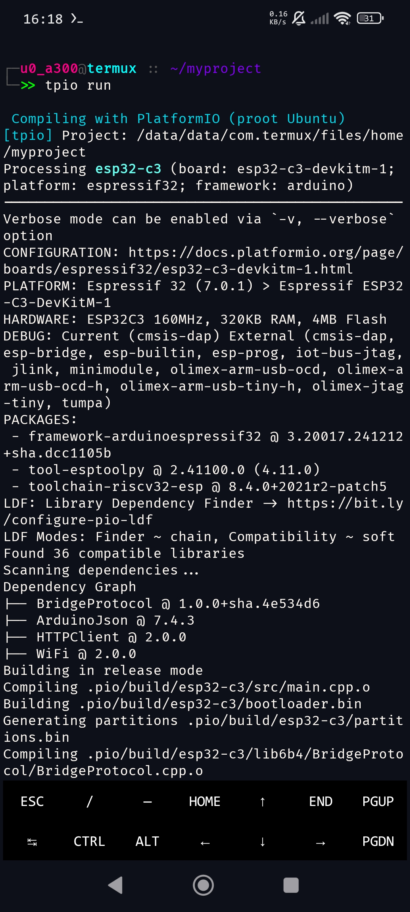
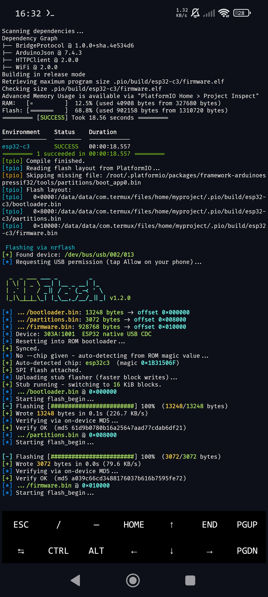
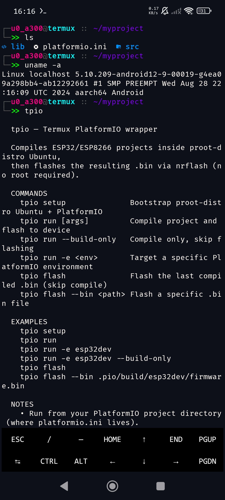
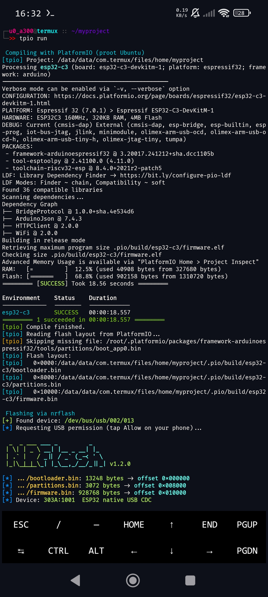
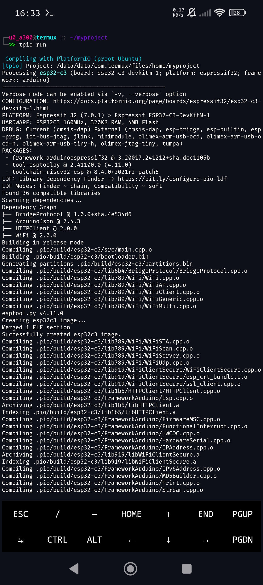

# Termux-PlatformIO

Compile ESP32/ESP8266 PlatformIO projects on Android — no root, no desktop.

```
termux shell
  └─ tpio run
       ├─ proot-distro Ubuntu  →  pio run  →  firmware.bin
       └─ nrflash              →  USB flash (no /dev/tty* needed)
```

PlatformIO runs inside a proot-distro Ubuntu container (full Linux ABI, no root).  
Flashing is handled by [Termux-ESP-Flasher](https://github.com/7wp81x/Termux-ESP-Flasher) (`nrflash`), which talks directly to the ESP over raw USB — no serial device node required.

---

## Screenshots

<p align="center">
  
  
</p>
<p align="center">
  
  
</p>
<p align="center">
  
</p>

---

## Requirements

| Tool | Install |
|---|---|
| [Termux](https://f-droid.org/en/packages/com.termux/) | F-Droid |
| [Termux:API](https://f-droid.org/en/packages/com.termux.api/) | F-Droid |
| [Termux-ESP-Flasher](https://github.com/7wp81x/Termux-ESP-Flasher) | see below |

> Use the **F-Droid** versions of Termux and Termux:API — the Play Store builds are outdated.

---

## Install

```bash
# 1. Clone this repo
git clone https://github.com/7wp81x/Termux-PlatformIO
cd Termux-PlatformIO
bash install.sh

# 2. Clone nrflash (Termux-ESP-Flasher) and put it on PATH
git clone https://github.com/7wp81x/Termux-ESP-Flasher ~/nrflash
echo 'export PATH="$HOME/nrflash:$PATH"' >> ~/.bashrc
source ~/.bashrc

# 3. Install Termux deps
pkg install python termux-api libusb
pip install pyusb

# 4. Bootstrap proot Ubuntu + PlatformIO (one-time, ~5 min)
tpio setup
```

---

## Usage

```bash
# From your PlatformIO project directory (where platformio.ini lives):

tpio run                        # compile + flash
tpio run -e esp32dev            # target a specific environment
tpio run --build-only           # compile only, skip flash
tpio flash                      # flash last compiled .bin
tpio flash --bin path/to/fw.bin # flash a specific binary
```

### First run

When `tpio run` triggers the USB flash step, Android will show a **USB permission dialog** — tap **OK**. The permission sticks until you unplug.

---

## How it works

### Compile step (`proot-distro`)

`tpio run` calls `proot-distro login ubuntu --no-link2symlink` with your project directory bind-mounted at its original path. PlatformIO runs inside the Ubuntu container and writes build outputs back to `.pio/build/<env>/` on your Termux filesystem — no copy step needed.

### Flash step (`nrflash`)

After a successful build, `tpio` runs `pio run -v -t upload` inside proot with a dummy port to intercept the exact esptool command PlatformIO would use. It parses every `OFFSET FILE` pair from the `write_flash` line and passes them directly to `nrflash` — so offsets are always correct regardless of chip or partition layout.

Supports:

- Native USB CDC — ESP32-S3, C3, S2
- UART bridge — ESP32, ESP8266 via CP2102, CH340, CH9102, FTDI

### Flash offset detection

Offsets are read directly from PlatformIO's verbose upload output, which means they're always correct for your specific chip:

| Chip | Bootloader | Partitions | App |
|---|---|---|---|
| ESP32, ESP32-S2 | `0x1000` | `0x8000` | `0x10000` |
| ESP32-C3, C6, S3, H2 | `0x0` | `0x8000` | `0x10000` |
| ESP8266 | — | — | `0x0` |

If PlatformIO output can't be parsed, tpio falls back to scanning the build directory and guessing offsets from the environment name.

---

## Config

Optional config file at `~/.tpio_config` (sourced as bash):

```bash
# ~/.tpio_config
NRFLASH_PATH=/data/data/com.termux/files/home/nrflash/nrflash
```

Useful if `nrflash` isn't on your `$PATH`.

---

## Troubleshooting

**`pio: command not found` inside proot**  
Re-run `tpio setup` — it installs PlatformIO in a venv and creates a `/usr/local/bin/pio` shim inside Ubuntu.

**`nrflash not found`**  
Make sure `~/nrflash` (or wherever you cloned Termux-ESP-Flasher) is on your `$PATH`, or set `NRFLASH_PATH` in `~/.tpio_config`.

**USB permission dialog doesn't appear**  
Unplug and replug the OTG cable, then retry `tpio flash`.

**Flashing fails after successful compile**  
Try `tpio flash` standalone — the compile step exits cleanly even if flash fails. Check that Termux:API is installed from F-Droid (not Play Store).

**Wrong environment flashed (multiple envs in platformio.ini)**  
Pass `-e <env>` explicitly: `tpio run -e esp32dev`.

**Toolchain extraction stalls with `.l2s` warnings**  
This is fixed by `--no-link2symlink` which tpio passes automatically. If you see it anyway, make sure you're on the latest version: `git pull && bash install.sh`.

---

## Related projects

- [Termux-ESP-Flasher](https://github.com/7wp81x/Termux-ESP-Flasher) — the `nrflash` binary used for flashing
- [ESP-Bridge](https://github.com/7wp81x/ESP-Bridge) — framed USB bridge protocol for ESP32 ↔ Termux communication

---

## License

MIT